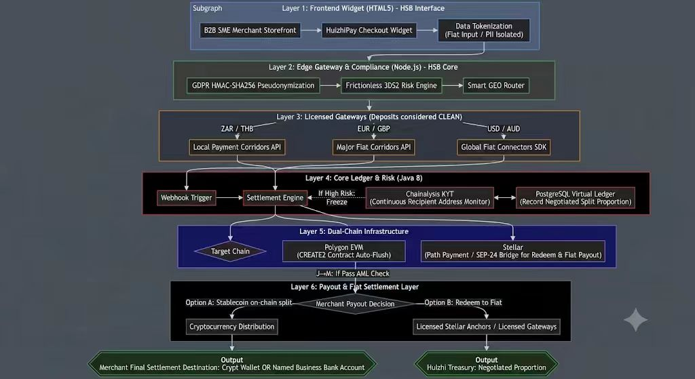
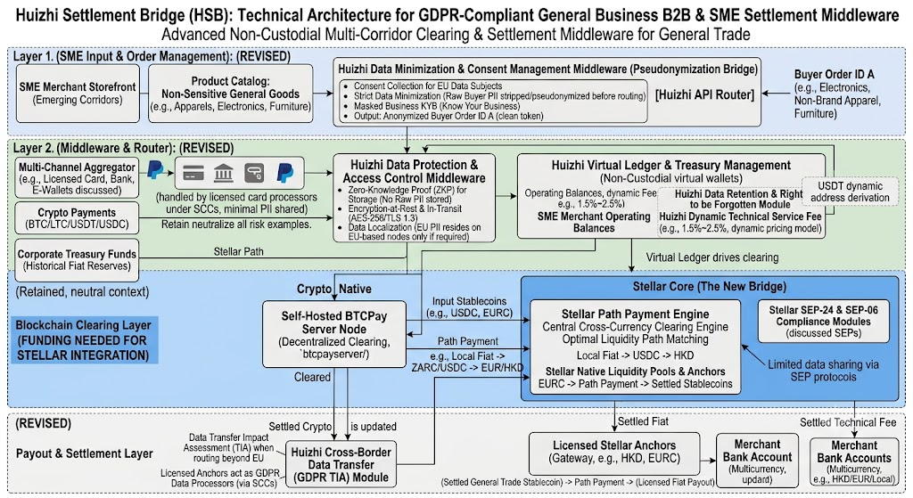

<div align="center">

# Huizhi Settlement Bridge (HSB)

**GDPR-Compliant Cross-Border B2B & SME Settlement Middleware**

[](https://github.com/banlijam/huizhi)
[](LICENSE)
[](https://adoptium.net/)
[](https://spring.io/projects/spring-boot)

[English](README.md) · [中文](README.zh-CN.md)

</div>

---

## 🌟 Overview

**Huizhi Settlement Bridge (HSB)** is an API-driven, non-custodial financial infrastructure that optimizes cross-border
B2B settlement across high-friction corridors.

Traditional mechanisms suffer from extended clearing cycles and high costs for SMEs. HSB solves this as a headless
middleware routing engine, bridging compliant fiat gateways with distributed ledger clearing networks.

### Key Highlights

- **Non-Custodial Architecture**: Zero counterparty risk — funds flow directly between sender and receiver
- **Multi-Corridor Clearing**: Supports emerging corridors (e.g., Africa, Latin America) where traditional rails are
  limited
- **GDPR Compliance**: Built-in data minimization and consent management middleware
- **Sub-Second Settlement**: Leverages Stellar Network for instant, low-cost cross-border transactions
- **SEPs & Standards**: Implements SEP-06 and SEP-24 for secure deposit/withdrawal workflows

---

## 🏗️ Architecture

HSB adopts a "Compliance-First, Dual-Chain Execution" strategy. The architecture is documented from two complementary
perspectives:

### 1. System Execution & Risk Control Flow (Developer View)

*End-to-end transaction lifecycle, risk decision points, and dual-chain routing logic.*

<div align="center">
  
</div>

> 💡 Click the diagram to zoom in. For GDPR data flow and Stellar settlement logic, refer to the breakdown below.

**Technical Execution Breakdown:**

| Layer  | Component                 | Key Operations                                                                                                                             | External API / Dependency                                            |
|:------:|:--------------------------|:-------------------------------------------------------------------------------------------------------------------------------------------|:---------------------------------------------------------------------|
| **L1** | Frontend Widget           | Merchant storefront integrates HuizhiPay Checkout Widget; raw PII data isolated & tokenized.                                               | Merchant's own backend API.                                          |
| **L2** | Edge Gateway & Compliance | GDPR HMAC-SHA256 pseudonymization; Frictionless 3DS2 risk scoring; Smart GEO routing.                                                      | Internal pseudonymization service; 3DS2 engine (e.g., Zai/Razorpay). |
| **L3** | Licensed Gateways         | Submit payments via Local (ZAR/THB), Major Fiat (EUR/GBP), and Global FX corridors.                                                        | Regional payment gateways; International card/bank APIs.             |
| **L4** | Core Ledger & Risk        | Webhook triggers; **Chainalysis KYT** continuous AML monitoring (high-risk → **Freeze**); PostgreSQL records negotiated split proportions. | Chainalysis KYT API; Internal webhooks.                              |
| **L5** | Dual-Chain Infrastructure | **Polygon EVM** (CREATE2 auto-flush for high-frequency txs) **&** **Stellar** (SEP-24 path payments for compliant fiat redeem).            | Polygon RPC; Stellar Horizon & Anchor SEP-24 APIs.                   |
| **L6** | Payout & Settlement       | On-chain split distribution; Merchant chooses **Crypto Wallet** OR **Fiat Bank Account** via licensed Stellar Anchors.                     | Stellar Anchor payout API; Banking SPDD/SEPA gateways.               |

---

### 2. Compliance & Cross-Border Clearing Architecture (Audit View)

*Focus on GDPR data sovereignty, minimized PII flow, and Stellar-based cross-currency clearing mechanism.*

<div align="center">
  
</div>

> 💡 Click the diagram to zoom in. Detailed API endpoints are listed in the table below.

**Compliance & Clearing Layer Breakdown:**

| Layer                    | Description                                                                                                                                                                              |
|:-------------------------|:-----------------------------------------------------------------------------------------------------------------------------------------------------------------------------------------|
| **Layer 1 (Input)**      | SME Merchant Storefront with strict Data Minimization & Consent Management. Raw buyer PII is stripped/pseudonymized before routing (Pseudonymization Bridge).                            |
| **Layer 2 (Middleware)** | Multi-channel aggregator (Cards/Banks/E-wallets/Crypto). Zero-Knowledge Proof (ZKP) for storage; AES-256/TLS 1.3 encryption; Non-custodial virtual ledger with dynamic fees (1.5%-2.5%). |
| **Blockchain Clearing**  | **Stellar Core** as the new bridge. Utilizes Path Payment Engine for optimal liquidity matching (Local Fiat → USDC → EUR/HKD). Supports SEP-24 & SEP-06 compliance modules.              |
| **Payout & Settlement**  | GDPR Transfer Impact Assessment (TIA) for cross-border data routing. Settled via licensed Stellar Anchors (EURC/HKD) directly to merchant multi-currency bank accounts.                  |

## 🚀 Quick Start

### Prerequisites

- **Java 21+**
- **Maven 3.8+**
- **PostgreSQL 15+**
- **Node.js 20+** (for frontend)
- **Stellar Account** (testnet for development)

### Backend Setup

```bash
# Clone the repository
git clone https://github.com/banlijam/huizhi.git
cd huizhi

# Configure database
# Edit huizhipay-bootstrap/src/main/resources/application.yml

# Build the project
mvn clean install -DskipTests

# Run the application
cd huizhipay-bootstrap
mvn spring-boot:run
```

### Frontend Setup

```bash
# Navigate to frontend directory
cd huizhipay-frontend

# Install dependencies
npm install

# Start development server
npm start
```

Visit `http://localhost:3000` to access the dashboard.

---

## 📁 Project Structure

```
huizhipay/
├── huizhipay-common/          # Common utilities, models, configurations
├── huizhipay-extensions/      # Manifold extensions (StringExtension, BigDecimal)
├── huizhipay-user/            # User service (Auth, Registration, TOTP)
├── huizhipay-acquiring/       # Payment acquiring service
├── huizhipay-ledger/          # Ledger and accounting service
├── huizhipay-risk/            # Risk management service
├── huizhipay-settlement/      # Settlement processing service
├── huizhipay-bootstrap/       # Application bootstrap and configuration
├── huizhipay-frontend/        # Frontend dashboard (Vanilla JS)
└── docs/                      # Documentation and diagrams
```

---

## 🔧 Core Modules

| Module           | Technology               | Description                                              |
|------------------|--------------------------|----------------------------------------------------------|
| **User Service** | Spring Security + JWT    | Authentication, TOTP, email verification, password reset |
| **Acquiring**    | Stellar SDK              | Crypto payments, multi-channel aggregation               |
| **Ledger**       | Double-entry bookkeeping | Virtual accounts, balances, fee management               |
| **Risk**         | Rule engine              | Transaction screening, anomaly detection                 |
| **Settlement**   | SEP-06/SEP-24            | Path payments, anchor integration                        |

---

## 📒 Ledger & Accounting Design

The ledger module implements **double-entry bookkeeping** — every transaction updates at least two accounts, and the sum of all amount changes is always zero.

The platform acts as a **collection agent**: funds are held in the platform's Transfi account, and the ledger tracks how much belongs to each merchant and what the platform has earned.

### Account Types

| Type | Balance Direction | Description |
|------|:-----------------:|-------------|
| `ASSET_AVAILABLE` | Positive (+) | Merchant's available balance (asset) |
| `LIABILITY_CUSTODY` | Negative (-) | Custody liability — negative balance represents what the platform owes to the merchant |
| `PLATFORM_INCOME` | Positive (+) | Platform's fee/revenue income |
| `PLATFORM_COST` | Positive (+) | Platform's expenses (e.g., supplier costs for KYC/KYT queries) |

### Business Flows

**Flow 1: Customer Payment / Recharge (1000, 7% fee)**

Customer pays 1000 → Platform receives funds through Transfi → Merchant gets 93% (930), platform keeps 7% (70) as fee.

| Account | Amount | Meaning |
|---------|:------:|---------|
| `ASSET_AVAILABLE` | +930 | Merchant's available balance increases (93% net) |
| `PLATFORM_INCOME` | +70 | Platform fee income (7%) |
| `LIABILITY_CUSTODY` | -1000 | Custody liability increases (balance goes more negative) |

> Sum: 930 + 70 - 1000 = 0 ✓

**Flow 2: Merchant Payout / Withdrawal (500)**

Merchant withdraws 500 to their wallet → Platform calls Transfi to send funds.

| Account | Amount | Meaning |
|---------|:------:|---------|
| `ASSET_AVAILABLE` | -500 | Merchant's available balance decreases |
| `LIABILITY_CUSTODY` | +500 | Custody liability decreases (balance goes less negative) |

> Sum: -500 + 500 = 0 ✓

**Flow 3: External Query Cost (KYC/KYT, platform pays supplier 0.8)**

When the platform needs to perform an external query, it pays the supplier directly from its own income.

| Account | Amount | Meaning |
|---------|:------:|---------|
| `PLATFORM_COST` | +0.8 | Supplier cost incurred (expense) |
| `PLATFORM_INCOME` | -0.8 | Platform income reduced to pay the supplier |

> Sum: +0.8 - 0.8 = 0 ✓

---

## 🔐 Security

- **JWT + HttpOnly Cookies**: Secure token management
- **GDPR Compliance**: Data minimization, consent management
- **Encryption at Rest & in Transit**: AES-256, TLS 1.3
- **TOTP Two-Factor Authentication**: RFC 6238 compliant
- **Input/Output Validation**: Strict schema validation

---

## 🌍 API Documentation

Start the application and navigate to:

- Swagger UI: `http://localhost:8080/swagger-ui.html`
- API Docs: `http://localhost:8080/api-docs`

### Key Endpoints

| Method | Endpoint                       | Description                 |
|--------|--------------------------------|-----------------------------|
| `POST` | `/api/v1/auth/register`        | Register new user           |
| `POST` | `/api/v1/auth/login`           | Login with email + password |
| `POST` | `/api/v1/auth/logout`          | Logout and clear session    |
| `GET`  | `/api/v1/auth/me`              | Get current user info       |
| `POST` | `/api/v1/auth/forgot-password` | Request password reset      |
| `GET`  | `/api/v1/auth/verify-email`    | Verify email with token     |

---

## 📄 License

This project is licensed under the Apache License 2.0 - see the [LICENSE](LICENSE) file for details.

---

## 🙏 Support

If you find HSB useful, please consider:

- ⭐ Starring the repository on GitHub
- 🔄 Sharing with your network
- 💬 Providing feedback and suggestions

For enterprise support or partnerships, contact us at **service@huizhipay.com**