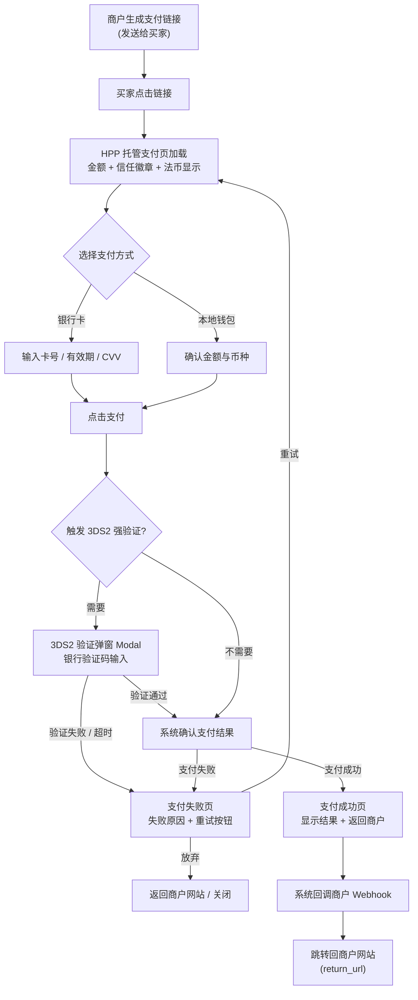
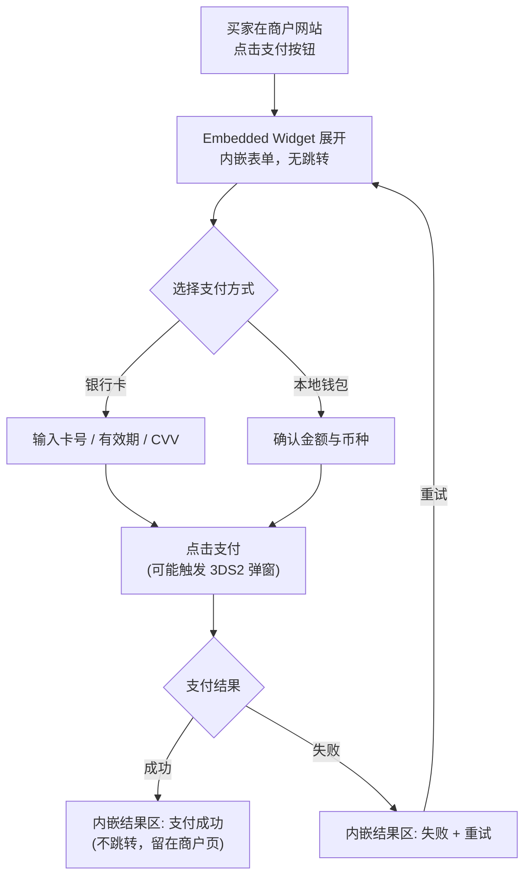
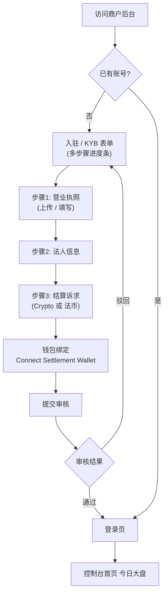
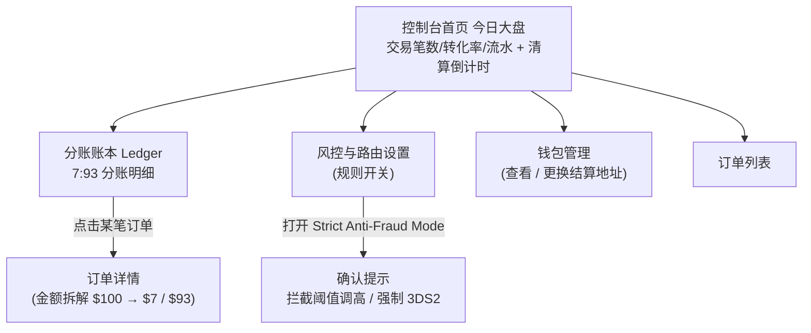
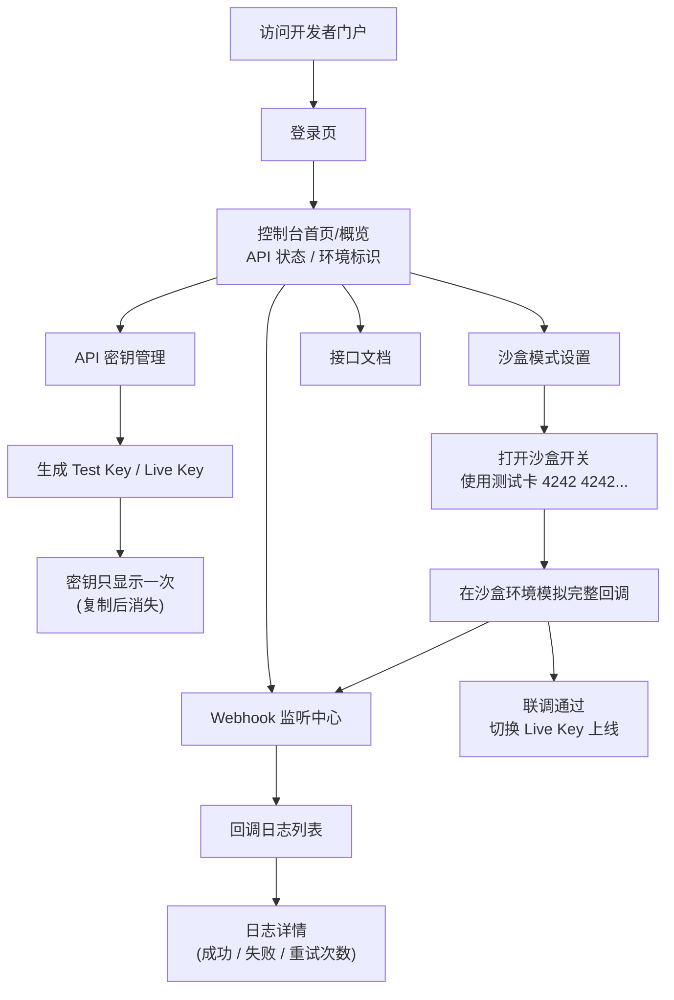
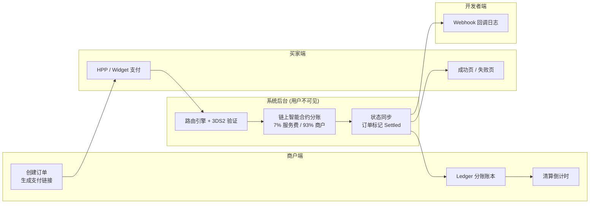

# 页面流转图

> 来源：[[pay支付项目/pm/三大页面流转和开发详细需求，以及原型图]]
> 配套：[[pay支付项目/pm/页面清单]]
> 更新时间：2026-08-09

## 0. 读图说明

- `圆角矩形` = 页面/动作
- `菱形` = 决策点（分支）
- `带箭头实线` = 流转方向
- 图中只画**用户可见的页面流转**；底层的链上分账、路由引擎等属于系统后台，用户不可见，单独在「跨端数据流图」说明。

---

## 1. 买家端 Checkout

### 1.1 HPP 托管支付页流转（买家走支付链接）

**读图要点（开发会问的问题）：**
- 3DS2 是**决策点**：什么条件触发强验证？→ 后续在风控需求里定（如金额阈值、风险评分）。
- 失败页 → 重试 → 回到 HPP 是**循环**，要防重复扣款（幂等），这是支付的核心。
- 成功后才触发 Webhook 回调，再跳转 return_url；**回调失败怎么办**（重试策略）在开发者端需求里定。

### 1.2 Embedded Widget 流转（买家在商户网站内完成支付）

---

## 2. 商户端 Merchant Dashboard

### 2.1 入驻（Onboarding & KYB）与登录流转

**读图要点：**
- 审核**驳回回到表单**，要支持草稿保存（填了一半能存）。
- 钱包绑定放在 KYB 提交前，是结算依赖，属于 P0。

### 2.2 登录后页面导航

---

## 3. 开发者端 Developer Portal

**读图要点：**
- 沙盒 → 联调 → 切 Live Key 是一条**主线**，体现"开发者从测试到上线的完整路径"。
- 密钥"只显示一次"是安全关键点，原型图里要画清楚（显示一次 + 强制复制 + 之后只能轮换）。

---

## 4. 跨端数据流图（一笔订单的旅程）

一笔订单在三个端不是"页面跳转"，而是**同一个业务在不同角色眼中的三个视图**：

**读图要点：**
- 买家端只看到"法币支付"（Fiat-to-Fiat Illusion），看不到 USDT/链上分账。
- 一笔订单会同时在三个端出现：买家端是"支付结果"，商户端是"分账记录 + 清算倒计时"，开发者端是"一条 Webhook 回调日志"。
- 这张图是后面三份 PRD 需求能对齐的锚点。

---

## 5. 待确认问题（画图时暴露出来的）

1. 3DS2 强验证的**触发条件**由谁定？金额阈值 / 风控评分？
2. 支付失败后的**重试**是否限制次数？超过后怎么办？
3. HPP 与 Widget 的**成功页**是否共用一套模板？
4. 商户 KYB 提交后**审核人**是谁？（人工 / 自动）
5. Webhook 回调失败的**重试策略**（次数、间隔、死信处理）？

这些先记录，后续在 PRD 阶段逐一定掉。
